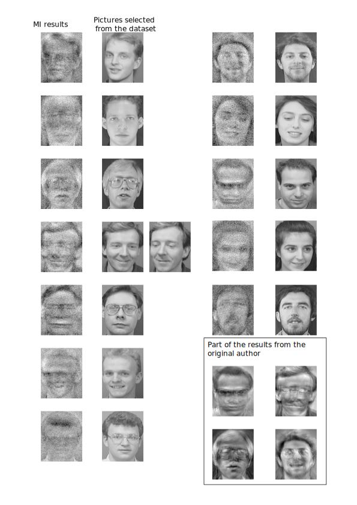

# MIA
Unofficial Pytorch implementation of paper: Model Inversion Attacks that Exploit Confidence Information and Basic Countermeasures

## Description
This this an <b>unofficial</b> pytorch implementation of paper: Matt Fredrikson, Somesh Jha, and Thomas Ristenpart. 2015. Model Inversion Attacks that Exploit Confidence Information and Basic Countermeasures. In <i>Proceedings of the 22nd ACM SIGSAC Conference on Computer and Communications Security</i> (<i>CCS '15</i>). Association for Computing Machinery, New York, NY, USA, 1322–1333. DOI:https://doi.org/10.1145/2810103.2813677

The official code from the author can be found at: https://www.cs.cmu.edu/~mfredrik/

The results from the original author can be found at https://github.com/mfredrik/facematch

## Usage

The main branch contains the code for attacking logistic regression network, the MLP branch contains the code for attacking multi-layer perception network with a hidden layer of 3000 neurals, both are described in the paper.

* main.py -- train the target network
* test.py -- test the target network
* attack.py -- perform model inversion attack
* turn_to_list.py -- code to make the dataset index
* attfdbtrain.txt and attfdbtest.txt -- the two dataset index file
* log/ -- directory contains the full results, use `tensorboard --logdir .` to see them.

<b>IMPORTANT: The code runs successfully on my machine. However, I might forgot to describe some details when writting this readme. So feel free to contact me via [email](mailto:zhangzp9970@outlook.com) or GitHub issues :)</b>

## Third-party libraries

* pytorch 1.8.1
* torchvision
* [easydl](https://github.com/thuml/easydl)
* tqdm
* numpy
* some standard python libs

## Differents

 The original at&t face database contains 400 images in different folders named s1-s40, there is also a readme file. I deleted the readme file and renamed s1-s40 to 0-39. Especially, s40 is renamed to 0. Thus, the dataset can be easily read by python and 0-39 are the 40 different labels. Besides, the author of the paper use 7 images in each class for training and the other 3 images for test. I divided the dataset into 2 parts by hand in order to avoid complicated python code filtering the images. The two folders are named attfdbtrain and attfdbtest, respectively. 

Unlike the author, I use 64 images as a minibatch to train the network. From my perspective, it is not a good idea to train the network with only 1 images in each minibatch.

In attack.py, instead of Gradient Descent, SGD is used to achieve a high performance on gradient descent. See https://pytorch.org/docs/stable/generated/torch.optim.SGD.html#torch.optim.SGD for more information.

In attack.py, torch.nn.CrossEntropyLoss is used as the cost function for better results, which still have the same meaning as the original

Denoise techniques such as ZCA are not implemented, so the results have little noisy

## Results

## License

Copyright © 2021 Zeping Zhang

This program is free software: you can redistribute it and/or modify
it under the terms of the GNU General Public License as published by
the Free Software Foundation, either version 3 of the License, or
(at your option) any later version.

This program is distributed in the hope that it will be useful,
but WITHOUT ANY WARRANTY; without even the implied warranty of
MERCHANTABILITY or FITNESS FOR A PARTICULAR PURPOSE.  See the
GNU General Public License for more details.

You should have received a copy of the GNU General Public License
along with this program.  If not, see <http://www.gnu.org/licenses/>.